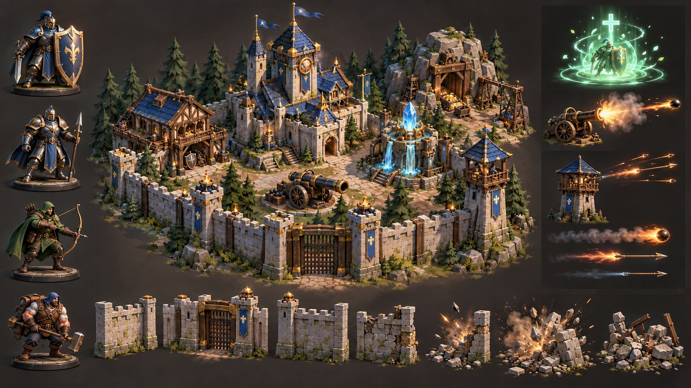

# 0.6.1 原创视觉落地

这张方向板由 OpenAI 内置 ImageGen 在 0.6 开发期间生成，用于确定原创林地堡垒、四类兵种、治疗、重弩炮和哨塔反击的比例、材质与色彩。0.6.1 没有把整张方向板冒充游戏场景，而是以它为参考，逐张生成并接入独立运行素材。

## 已接入运行时

- `Resources/GeneratedArt` 包含主堡、金矿、晶露池、远征营、重弩炮、哨塔六张独立建筑画面，以及先锋、游侠、铁卫、破城手四格兵种画面。
- 建筑改成独立文件是有意的：早期总图会把相邻格子的旗帜和火把裁进当前建筑，已经弃用并从项目删除。
- PNG 使用洋红色生成背景，Unity 通过 `Hearthhold/ChromaKeySprite` 在运行时去底；程序化网格切到仅投射阴影，并继续提供碰撞体。
- 城墙仍使用浅石色连续程序化网格，避免把单格立绘中的旗帜或火把在整圈墙上机械重复。
- 兵种立绘以前景可读方式绘制并放大，正常缩放下仍能区分盾牌、弓、重甲和破城锤。

## 视觉原则

- 建筑使用深青屋顶、暖色石材、可辨识木纹色块和黄铜焦点，避免所有表面像同一种塑料。
- 单位通过盾牌、弓与箭袋、重甲肩甲、短柄破城锤等装备形成职业轮廓；铁卫整体比例最大。
- 游侠与哨塔使用细长箭矢，重弩炮使用带烟尾的高亮重弹，近战只保留短促的小范围命中圈。
- 治疗使用薄荷色双环与上升光点；摧毁使用尘圈、石块和暖色火星，控制持续时间与屏幕占比。
- 主城镜头更近，暖色主光配冷色环境补光；顶面提亮、阴影和边缘光共同增强等距视角可读性。

## 尚未达到的部分

当前方案是面向固定等距镜头的二维生成式画面与三维地形/阴影混合，不是可任意旋转的完整三维模型。仍没有骨骼动画、多角度动作、法线/粗糙度贴图或专业 DCC 资产；后续若推进正式美术，应把这里的造型当作建模参考，而不是继续无限叠加平面立绘。
